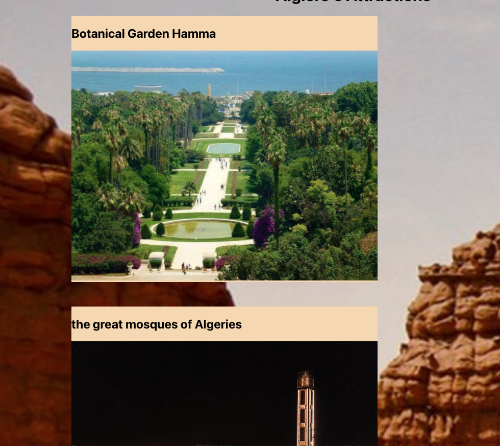

# Discover Algeria

## Link to the deployed APP: [Discover Algeria](https://discover-algeria.netlify.app/)

## About

Dicover Algeria is a website where you can learn about the big and diverse continent like "Algeria". you can look up states by region and then discover the attractions available for that specific state. the website started only with 15 states for the hope of adding more states by users. if you want to add a state click on the plus button after navigating to a specific region and add you state and let the world enjoy and discoer it. the technologies used tp buil this app are REEAT.js mertialUI, CSS HTML

## Technologies use

- React.js
- HTML
- CSS
- Javascript
- Heroku
- MaterialUi

## wireframe

## App Screenshot

## User stories

### MVP 
* As a user, I want to be able to look up States by the type of region
* As a user, I want to be able to see the food and clothes of the state I select
* As a user, I want to see attractions of the state I select
* As a user, I want to be able to add a state

### Stretch Goals:
* As a user, I want to see some random pictures of some states
* AS a user, I want to be able to look up destination by state
 As a user, I want to be able to create an account
As a user, i wan to be able to like, and delete a state in my favorites